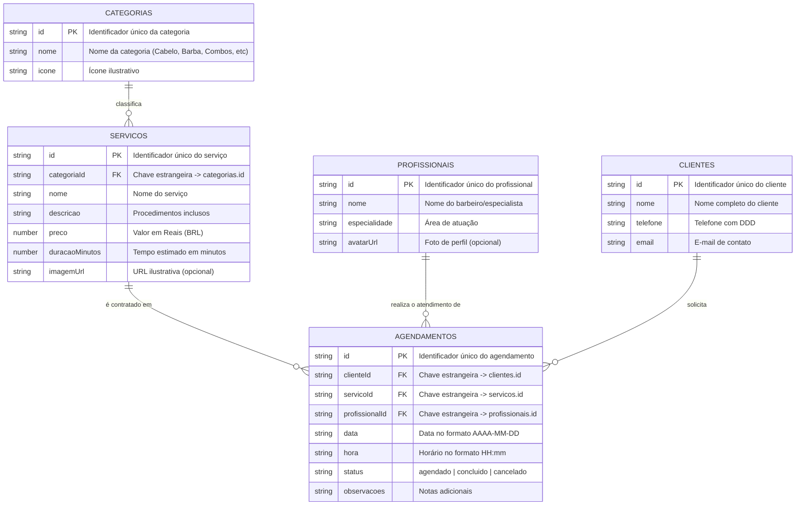

# 💈 DOCUMENTAÇÃO DE MODELAGEM E PROJETO - PAM
## Disciplina: Programação de Aplicativos Móveis (PAM)
### 1ª Parte do Projeto: Escolha do Tema & Modelagem Normalizada (5 Tabelas - 3FN)

---

## 👥 1. Identificação da Dupla & Tema Escolhido

- **Integrantes da Dupla:** [Nome do Integrante 1] e [Nome do Integrante 2]
- **Tema do Projeto:** Sistema de Agendamento (Nicho: Barbearia & Estética Masculina / *BarberFlow*)
- **Plataforma:** Mobile (React Native + Expo) com consumo de API REST (`json-server`)

### 📝 Justificativa e Escopo da Aplicação:
> O aplicativo **BarberFlow** implementa operações completas de **CRUD** (Create, Read, Update, Delete) consumindo endpoints REST via protocolo HTTP com Axios. O banco de dados foi projetado em conformidade com a **3ª Forma Normal (3FN)**, estruturado em **5 entidades interligadas**: Categorias, Serviços, Profissionais, Clientes e Agendamentos. O sistema conta com validações rigorosas no front-end, contingência offline automática e design escuro premium (*Dark Gold*) com acessibilidade total.

---

## 📊 2. Modelagem Lógica (DER - Diagrama Entidade-Relacionamento)

---

## 🗄️ 3. Modelagem Física

### 3.1 Dicionário de Dados

1. **`categorias`**: `id` (PK, VARCHAR), `nome` (VARCHAR(50), NOT NULL), `icone` (VARCHAR(50)).
2. **`servicos`**: `id` (PK, VARCHAR), `categoriaId` (FK, VARCHAR, NOT NULL), `nome` (VARCHAR(100), NOT NULL), `descricao` (TEXT, NOT NULL), `preco` (DECIMAL(10,2), NOT NULL), `duracaoMinutos` (INT, NOT NULL), `imagemUrl` (VARCHAR(255)).
3. **`profissionais`**: `id` (PK, VARCHAR), `nome` (VARCHAR(100), NOT NULL), `especialidade` (VARCHAR(100), NOT NULL), `avatarUrl` (VARCHAR(255)).
4. **`clientes`**: `id` (PK, VARCHAR), `nome` (VARCHAR(100), NOT NULL), `telefone` (VARCHAR(20), NOT NULL), `email` (VARCHAR(100)).
5. **`agendamentos`**: `id` (PK, VARCHAR), `clienteId` (FK, VARCHAR, NOT NULL), `servicoId` (FK, VARCHAR, NOT NULL), `profissionalId` (FK, VARCHAR, NOT NULL), `data` (DATE, NOT NULL), `hora` (VARCHAR(5), NOT NULL), `status` (VARCHAR(20), NOT NULL), `observacoes` (TEXT).

---

## 🌐 4. Especificação de Rotas da API REST

| Operação | Método | Rota | Descrição |
| :--- | :--- | :--- | :--- |
| **Listar Agendamentos** | `GET` | `/agendamentos` | Lista agendamentos (suporta filtros `?status=` e `?data=`) |
| **Consultar Agendamento** | `GET` | `/agendamentos/:id` | Detalhes de um agendamento específico |
| **Cadastrar Agendamento** | `POST` | `/agendamentos` | Cria agendamento com `clienteId`, `servicoId` e `profissionalId` |
| **Atualizar Status** | `PATCH` | `/agendamentos/:id` | Altera status (`concluido`/`cancelado`) |
| **Remover Agendamento** | `DELETE`| `/agendamentos/:id` | Remove agendamento do histórico |
| **Clientes** | `GET` / `POST` | `/clientes` | Gerenciamento de clientes cadastrados |
| **Catálogo de Serviços** | `GET` | `/servicos` | Lista serviços com vínculo de categoria |
| **Categorias** | `GET` | `/categorias` | Lista as categorias de serviços |
| **Profissionais** | `GET` | `/profissionais` | Lista a equipe de barbeiros |
