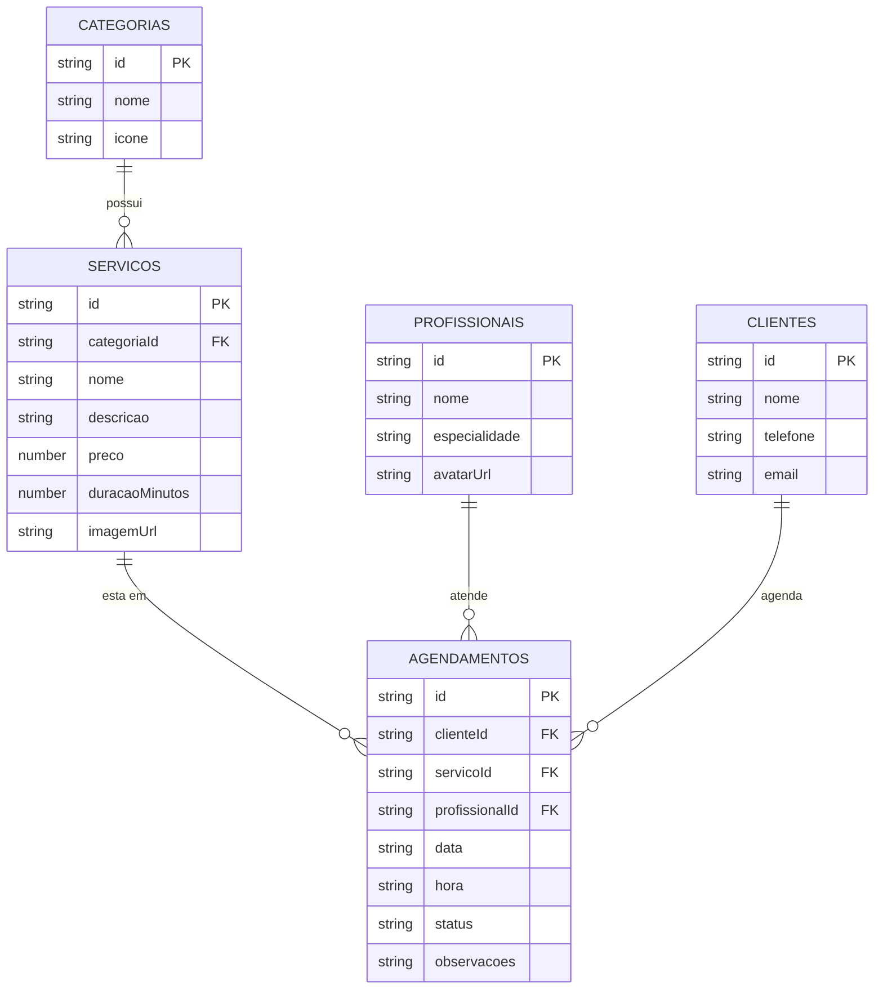

# Projeto PAM - 1ª Parte: Modelagem de Banco de Dados

## Identificação
- Integrantes: [Nome 1] e [Nome 2]
- Tema: Sistema de Agendamento (Barbearia / BarberFlow)
- Tecnologias: React Native, Expo, Axios e json-server

## Descrição do Projeto
Aplicação mobile para gerenciamento de agendamentos em uma barbearia. O sistema permite listar serviços, escolher profissionais, cadastrar novos agendamentos e gerenciar o status dos atendimentos (agendado, concluído ou cancelado). Os dados são consumidos via API REST simulada com json-server.

---

## 1. Modelagem Lógica (Diagrama Entidade-Relacionamento)

### Entidades e Relacionamentos:
- **categorias (1,1) ---- (0,N) servicos**: Uma categoria agrupa vários serviços.
- **servicos (1,1) ---- (0,N) agendamentos**: Cada agendamento possui um serviço contratado.
- **profissionais (1,1) ---- (0,N) agendamentos**: Cada agendamento é atendido por um profissional.
- **clientes (1,1) ---- (0,N) agendamentos**: Um cliente pode ter vários agendamentos.

---

## 2. Modelagem Física

### Dicionário de Dados

1. **categorias**
   - `id`: VARCHAR(36) - Chave Primária (PK)
   - `nome`: VARCHAR(50) - Nome da categoria
   - `icone`: VARCHAR(50) - Ícone representativo

2. **servicos**
   - `id`: VARCHAR(36) - Chave Primária (PK)
   - `categoriaId`: VARCHAR(36) - Chave Estrangeira (FK categorias)
   - `nome`: VARCHAR(100) - Nome do serviço
   - `descricao`: TEXT - Detalhes do serviço
   - `preco`: DECIMAL(10,2) - Valor do serviço
   - `duracaoMinutos`: INT - Duração estimada em minutos
   - `imagemUrl`: VARCHAR(255) - Link da imagem

3. **profissionais**
   - `id`: VARCHAR(36) - Chave Primária (PK)
   - `nome`: VARCHAR(100) - Nome do profissional
   - `especialidade`: VARCHAR(100) - Especialidade
   - `avatarUrl`: VARCHAR(255) - Foto de perfil

4. **clientes**
   - `id`: VARCHAR(36) - Chave Primária (PK)
   - `nome`: VARCHAR(100) - Nome do cliente
   - `telefone`: VARCHAR(20) - Telefone com DDD
   - `email`: VARCHAR(100) - E-mail do cliente

5. **agendamentos**
   - `id`: VARCHAR(36) - Chave Primária (PK)
   - `clienteId`: VARCHAR(36) - Chave Estrangeira (FK clientes)
   - `servicoId`: VARCHAR(36) - Chave Estrangeira (FK servicos)
   - `profissionalId`: VARCHAR(36) - Chave Estrangeira (FK profissionais)
   - `data`: DATE - Data do atendimento (AAAA-MM-DD)
   - `hora`: VARCHAR(5) - Horário do atendimento (HH:mm)
   - `status`: VARCHAR(20) - Situação: agendado, concluido ou cancelado
   - `observacoes`: TEXT - Observações gerais

---

## 3. Endpoints da API REST

| Método | Rota | Descrição |
| :--- | :--- | :--- |
| `GET` | `/agendamentos` | Lista todos os agendamentos |
| `GET` | `/agendamentos/:id` | Busca agendamento por ID |
| `POST` | `/agendamentos` | Cadastra novo agendamento |
| `PATCH` | `/agendamentos/:id` | Atualiza dados/status do agendamento |
| `DELETE` | `/agendamentos/:id` | Remove agendamento |
| `GET` | `/servicos` | Lista os serviços |
| `GET` | `/profissionais` | Lista os profissionais |
| `GET` | `/clientes` | Lista os clientes |
| `GET` | `/categorias` | Lista as categorias |
