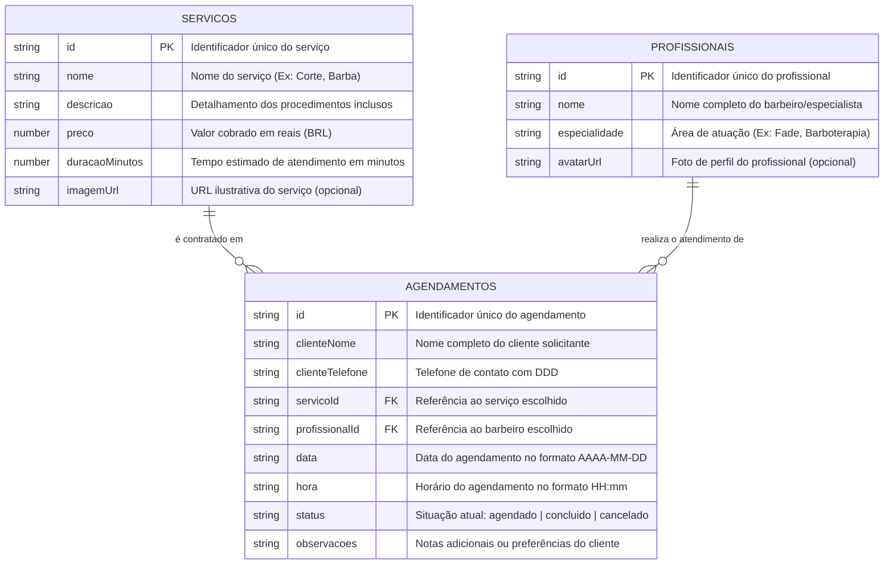

# 💈 DOCUMENTAÇÃO DE MODELAGEM E PROJETO - PAM
## Disciplina: Programação de Aplicativos Móveis (PAM)
### 1ª Parte do Projeto: Escolha do Tema & Modelagem (Lógica e Física)

---

## 👥 1. Identificação da Dupla & Tema Escolhido

- **Integrantes da Dupla:** [Nome do Integrante 1] e [Nome do Integrante 2]
- **Tema do Projeto:** Sistema de Agendamento (Nicho: Barbearia & Estética Masculina / *BarberFlow*)
- **Plataforma:** Mobile (React Native + Expo) com consumo de API REST (`json-server`)

### 📝 Justificativa e Escopo da Aplicação:
> A escolha do nicho de barbearia e estética justifica-se pela alta demanda do mercado por soluções mobile que otimizem o tempo de clientes e profissionais. O aplicativo **BarberFlow** implementa operações completas de **CRUD** (Create, Read, Update, Delete) consumindo endpoints REST via protocolo HTTP com Axios. O sistema conta com validações rigorosas no front-end (prevenção de agendamentos em horários passados, checagem de expediente comercial das 08h às 18h e máscara de telefone com DDD válido) e interface escura premium (*Dark Gold*) com total conformidade de acessibilidade (touch targets de 44pt).

---

## 📊 2. Modelagem Lógica (DER - Diagrama Entidade-Relacionamento)

### 2.1 Diagrama Entidade-Relacionamento (Conceitual/Lógico)



### 2.2 Cardinalidades e Regras de Negócio:
1. **SERVIÇOS ➔ AGENDAMENTOS (1,1 : 0,N):**
   - Um serviço pode estar associado a **nenhum ou vários** agendamentos (`0,N`).
   - Cada agendamento refere-se obrigatoriamente a **um e apenas um** serviço (`1,1`).
2. **PROFISSIONAIS ➔ AGENDAMENTOS (1,1 : 0,N):**
   - Um profissional pode realizar o atendimento de **nenhum ou vários** agendamentos (`0,N`).
   - Cada agendamento é atribuído a **um e apenas um** profissional (`1,1`).

---

## 🗄️ 3. Modelagem Física

### 3.1 Dicionário de Dados Completo

#### Tabela 1: `servicos`
| Campo | Tipo de Dado | Restrição | Obrigatório? | Descrição | Exemplo |
| :--- | :--- | :--- | :--- | :--- | :--- |
| `id` | `VARCHAR(36)` / `TEXT` | `PRIMARY KEY` | Sim | Identificador único | `"1"` |
| `nome` | `VARCHAR(100)` | `NOT NULL` | Sim | Nome comercial do serviço | `"Corte de Cabelo Premium"` |
| `descricao` | `TEXT` | `NOT NULL` | Sim | Descrição do procedimento | `"Corte moderno com tesoura e máquina"` |
| `preco` | `DECIMAL(10,2)` | `NOT NULL, >= 0` | Sim | Preço em Reais (BRL) | `55.00` |
| `duracaoMinutos` | `INT` | `NOT NULL, > 0` | Sim | Duração estimada em minutos | `45` |
| `imagemUrl` | `VARCHAR(255)` | `NULL` | Não | Link da foto representativa | `"https://images.unsplash.com/..."` |

#### Tabela 2: `profissionais`
| Campo | Tipo de Dado | Restrição | Obrigatório? | Descrição | Exemplo |
| :--- | :--- | :--- | :--- | :--- | :--- |
| `id` | `VARCHAR(36)` / `TEXT` | `PRIMARY KEY` | Sim | Identificador único | `"1"` |
| `nome` | `VARCHAR(100)` | `NOT NULL` | Sim | Nome do profissional | `"Carlos Silva (Mestre Barbeiro)"` |
| `especialidade` | `VARCHAR(100)` | `NOT NULL` | Sim | Especialidade técnica | `"Cortes Clássicos e Fade"` |
| `avatarUrl` | `VARCHAR(255)` | `NULL` | Não | Foto do perfil do barbeiro | `"https://images.unsplash.com/..."` |

#### Tabela 3: `agendamentos`
| Campo | Tipo de Dado | Restrição | Obrigatório? | Descrição | Exemplo |
| :--- | :--- | :--- | :--- | :--- | :--- |
| `id` | `VARCHAR(36)` / `TEXT` | `PRIMARY KEY` | Sim | Identificador único do agendamento | `"103"` ou `"cwn-mtk"` |
| `clienteNome` | `VARCHAR(100)` | `NOT NULL, min 3 carac.`| Sim | Nome do cliente | `"Lucas Gabriel"` |
| `clienteTelefone` | `VARCHAR(20)` | `NOT NULL, DDD válido` | Sim | Telefone formatado com DDD | `"(11) 98765-4321"` |
| `servicoId` | `VARCHAR(36)` | `FOREIGN KEY (servicos.id)` | Sim | Serviço contratado | `"1"` |
| `profissionalId` | `VARCHAR(36)` | `FOREIGN KEY (profissionais.id)` | Sim | Profissional escalado | `"1"` |
| `data` | `DATE` / `VARCHAR(10)`| `NOT NULL, AAAA-MM-DD` | Sim | Data do atendimento | `"2026-08-19"` |
| `hora` | `VARCHAR(5)` | `NOT NULL, 08:00 às 18:00` | Sim | Horário do atendimento | `"10:00"` |
| `status` | `ENUM` / `VARCHAR(20)`| `'agendado','concluido','cancelado'` | Sim | Situação do agendamento | `"agendado"` |
| `observacoes` | `TEXT` | `NULL` | Não | Observações extras | `"Corte degradê navalhado"` |

---

### 3.2 Script Físico SQL DDL (Padrão Banco de Dados Relacional)

```sql
-- Criação da Tabela de Serviços
CREATE TABLE servicos (
    id VARCHAR(36) PRIMARY KEY,
    nome VARCHAR(100) NOT NULL,
    descricao TEXT NOT NULL,
    preco DECIMAL(10,2) NOT NULL CHECK (preco >= 0),
    duracaoMinutos INT NOT NULL CHECK (duracaoMinutos > 0),
    imagemUrl VARCHAR(255)
);

-- Criação da Tabela de Profissionais
CREATE TABLE profissionais (
    id VARCHAR(36) PRIMARY KEY,
    nome VARCHAR(100) NOT NULL,
    especialidade VARCHAR(100) NOT NULL,
    avatarUrl VARCHAR(255)
);

-- Criação da Tabela de Agendamentos com Integridade Referencial
CREATE TABLE agendamentos (
    id VARCHAR(36) PRIMARY KEY,
    clienteNome VARCHAR(100) NOT NULL,
    clienteTelefone VARCHAR(20) NOT NULL,
    servicoId VARCHAR(36) NOT NULL,
    profissionalId VARCHAR(36) NOT NULL,
    data DATE NOT NULL,
    hora VARCHAR(5) NOT NULL,
    status VARCHAR(20) NOT NULL DEFAULT 'agendado' CHECK (status IN ('agendado', 'concluido', 'cancelado')),
    observacoes TEXT,
    CONSTRAINT fk_agendamento_servico FOREIGN KEY (servicoId) REFERENCES servicos(id) ON UPDATE CASCADE ON DELETE RESTRICT,
    CONSTRAINT fk_agendamento_profissional FOREIGN KEY (profissionalId) REFERENCES profissionais(id) ON UPDATE CASCADE ON DELETE RESTRICT
);
```

---

### 3.3 Estrutura Física em JSON para Simulação de Hospedagem (`db.json`)

```json
{
  "servicos": [
    {
      "id": "1",
      "nome": "Corte de Cabelo Premium",
      "descricao": "Corte moderno com tesoura e máquina, finalização com pomada importada e lavagem.",
      "preco": 55.0,
      "duracaoMinutos": 45,
      "imagemUrl": "https://images.unsplash.com/photo-1503951914875-452162b0f3f1?w=400"
    },
    {
      "id": "2",
      "nome": "Barba Completa com Toalha Quente",
      "descricao": "Modelagem de barba, esfoliação facial, alinhamento com navalha e hidratação com óleos essenciais.",
      "preco": 45.0,
      "duracaoMinutos": 35,
      "imagemUrl": "https://images.unsplash.com/photo-1621605815971-fbc98d665033?w=400"
    },
    {
      "id": "3",
      "nome": "Combo Barba & Cabelo",
      "descricao": "Experiência completa: Corte estilizado + barba completa com tratamento de toalha quente.",
      "preco": 90.0,
      "duracaoMinutos": 75,
      "imagemUrl": "https://images.unsplash.com/photo-1585747860715-2ba37e788b70?w=400"
    },
    {
      "id": "4",
      "nome": "Pigmentação de Barba",
      "descricao": "Preenchimento de falhas e alinhamento de contorno da barba com tinta hipoalergênica.",
      "preco": 35.0,
      "duracaoMinutos": 30,
      "imagemUrl": "https://images.unsplash.com/photo-1599351431202-1e0f0137899a?w=400"
    }
  ],
  "profissionais": [
    {
      "id": "1",
      "nome": "Carlos Silva (Mestre Barbeiro)",
      "especialidade": "Cortes Clássicos e Fade",
      "avatarUrl": "https://images.unsplash.com/photo-1534528741775-53994a69daeb?w=200"
    },
    {
      "id": "2",
      "nome": "Rafael Oliveira",
      "especialidade": "Barboterapia e Visagismo",
      "avatarUrl": "https://images.unsplash.com/photo-1507003211169-0a1dd7228f2d?w=200"
    },
    {
      "id": "3",
      "nome": "Lucas Mendes",
      "especialidade": "Colorimetria e Químicas",
      "avatarUrl": "https://images.unsplash.com/photo-1500648767791-00dcc994a43e?w=200"
    }
  ],
  "agendamentos": [
    {
      "id": "101",
      "clienteNome": "Carlos Eduardo",
      "clienteTelefone": "(11) 98765-4321",
      "servicoId": "1",
      "profissionalId": "1",
      "data": "2026-08-19",
      "hora": "09:00",
      "status": "agendado",
      "observacoes": "Corte degradê navalhado."
    },
    {
      "id": "102",
      "clienteNome": "Marcos Vinicius",
      "clienteTelefone": "(11) 91234-5678",
      "servicoId": "3",
      "profissionalId": "2",
      "data": "2026-08-19",
      "hora": "14:00",
      "status": "agendado",
      "observacoes": "Barboterapia com toalha quente."
    },
    {
      "id": "103",
      "clienteNome": "Felipe Rocha",
      "clienteTelefone": "(85) 99123-4567",
      "servicoId": "2",
      "profissionalId": "3",
      "data": "2026-08-05",
      "hora": "16:00",
      "status": "cancelado",
      "observacoes": "Cliente solicitou cancelamento por imprevisto."
    }
  ]
}
```

---

## 🌐 4. Especificação da API REST (Endpoints HTTP)

| Operação | Método HTTP | Rota (Endpoint) | Descrição da Requisição | Códigos de Resposta (Status) |
| :--- | :--- | :--- | :--- | :--- |
| **Listar** | `GET` | `/agendamentos` | Lista agendamentos (suporta filtros `?status=` e `?data=`) | `200 OK` |
| **Consultar** | `GET` | `/agendamentos/:id` | Recupera detalhes de um agendamento específico | `200 OK`, `404 Not Found` |
| **Cadastrar** | `POST` | `/agendamentos` | Cadastra novo agendamento com dados validados | `201 Created`, `400 Bad Request` |
| **Atualizar** | `PATCH` | `/agendamentos/:id` | Altera status (`concluido`/`cancelado`) ou dados | `200 OK`, `400 Bad Request` |
| **Remover** | `DELETE`| `/agendamentos/:id` | Remove agendamento do histórico | `200 OK`, `204 No Content` |
| **Catálogo** | `GET` | `/servicos` | Lista todos os serviços oferecidos | `200 OK` |
| **Equipe** | `GET` | `/profissionais` | Lista os profissionais cadastrados | `200 OK` |

---

## 📱 5. Arquitetura e Estrutura de Código

```text
PAM-ProgramacaoAplicativosMobile/
├── db.json                           # Banco de dados físico para simulação REST
├── server.js                         # Servidor REST HTTP e Dashboard de Monitoramento
├── App.tsx                           # Ponto de entrada com Theme Providers e CSS Engine
├── src/
│   ├── components/                   # Componentes reutilizáveis (Header, Cards, Spinners)
│   ├── constants/                    # Tokens de cores (Dark Gold Design System)
│   ├── routes/                       # Gerenciamento de rotas (Stack Navigator)
│   ├── screens/                      # Telas (Home, NovoAgendamento, Detalhes)
│   ├── services/                     # Comunicação HTTP Axios (api.ts, agendamentoService.ts)
│   ├── types/                        # Tipagens estritas TypeScript
│   └── utils/                        # Validadores e formatadores (telefone, moeda, datas)
└── scripts/                          # Scripts de inicialização e bateria de testes automatizados
```
