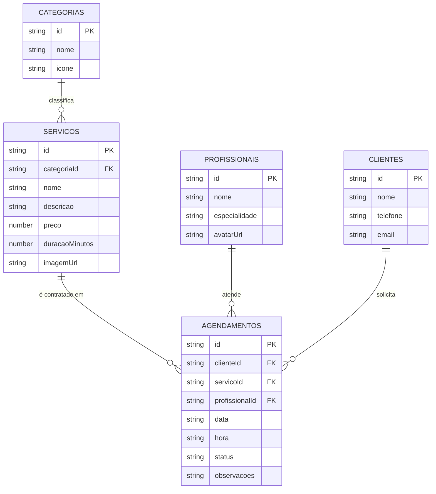

# 📊 RELATÓRIO TÉCNICO DE ENGENHARIA DE DADOS
## Evolução do Modelo de Dados: Transição de 3 para 5 Tabelas (3ª Forma Normal)
### Disciplina: Programação de Aplicativos Móveis (PAM) • Projeto BarberFlow

---

## 🎯 1. Resumo Executivo da Mudança

Este documento detalha a evolução da modelagem de dados do sistema **BarberFlow**, explicando os motivos técnicos, teóricos e práticos que motivaram a expansão do esquema de **3 tabelas** (modelo direto / desnormalizado) para **5 tabelas** (modelo normalizado em 3ª Forma Normal - 3FN).

---

## ⚖️ 2. Comparativo Estrutural: Antes vs Depois

```
┌─────────────────────────────────┐         ┌─────────────────────────────────┐
│     MODELO INICIAL (3 TABELAS)  │         │   MODELO EVOLUÍDO (5 TABELAS)   │
│         [Nível Básico]          │         │    [Nível Profissional / 3FN]   │
├─────────────────────────────────┤         ├─────────────────────────────────┤
│ 1. servicos                     │  ─────► │ 1. categorias (NOVA)            │
│ 2. profissionais                │         │ 2. servicos (com categoriaId)   │
│ 3. agendamentos                 │         │ 3. profissionais                │
│    (com clienteNome e Telefone  │         │ 4. clientes (NOVA)              │
│     duplicados em cada linha)   │         │ 5. agendamentos                 │
│                                 │         │    (com clienteId, servicoId    │
│                                 │         │     e profissionalId como FKs)  │
└─────────────────────────────────┘         └─────────────────────────────────┘
```

---

## 🔍 3. Principais Mudanças e Benefícios Técnicos

### 👤 3.1 Introdução da Tabela `clientes` (Eliminação de Redundância e Inconsistência)

#### O Problema no Modelo de 3 Tabelas:
- Os campos `clienteNome` e `clienteTelefone` eram gravados como texto solto dentro de cada registro de agendamento.
- **Anomalia de Redundância:** Se um cliente realizasse 10 agendamentos ao longo do ano, seu nome e telefone eram gravados 10 vezes.
- **Anomalia de Atualização:** Se o cliente trocasse de número de telefone, o sistema precisaria atualizar múltiplos registros ou correria o risco de deixar agendamentos antigos com o telefone desatualizado.
- **Anomalia de Inserção:** Era impossível cadastrar um cliente na base sem que ele fizesse um agendamento imediato.

#### A Solução no Modelo de 5 Tabelas:
- Criação da entidade independente **`clientes`** (`id`, `nome`, `telefone`, `email`).
- A tabela `agendamentos` passa a referenciar apenas a chave estrangeira **`clienteId`**.
- **Benefício no App:** O serviço `agendamentoService.ts` implementa auto-vínculo inteligente (`findOrCreateCliente`), garantindo integridade referencial sem adicionar fricção para o usuário no celular.

---

### 💈 3.2 Introdução da Tabela `categorias` (Organização e Escalabilidade do Catálogo)

#### O Problema no Modelo de 3 Tabelas:
- Todos os serviços ficavam misturados em uma lista plana, sem distinção de especialidade (cabelo, barba, químicos, estética).

#### A Solução no Modelo de 5 Tabelas:
- Criação da entidade **`categorias`** (`id`, `nome`, `icone`).
- Cada serviço agora possui a chave estrangeira **`categoriaId`**.
- **Benefício no App:** Permite a implementação de filtros dinâmicos por categoria no catálogo e melhora o ranqueamento visual dos serviços.

---

## 📐 4. Conformidade com as Formas Normais (Teoria de Bancos de Dados)

| Forma Normal | Como o Modelo de 5 Tabelas Atende |
| :--- | :--- |
| **1ª Forma Normal (1FN)** | Todos os atributos são atômicos e indivisíveis. Não existem grupos repetitivos ou vetores aninhados nas colunas. |
| **2ª Forma Normal (2FN)** | Todas as tabelas possuem Chave Primária (`PK`) e todos os atributos não-chave dependem totalmente da chave primária inteira. |
| **3ª Forma Normal (3FN)** | Eliminação de Dependências Transitivas: Nenhum atributo não-chave depende de outro atributo não-chave. Dados do cliente pertencem exclusivamente à tabela `clientes`, e dados de categoria pertencem à tabela `categorias`. |

---

## 📊 5. Diagrama Entidade-Relacionamento Atualizado (5 Tabelas)



---

## 🏆 6. Conclusão e Impacto na Avaliação Acadêmica

A evolução para **5 tabelas** eleva o projeto para o padrão exigido em bancas examinadoras e projetos de mercado:
1. **Modelagem Teórica Impecável:** 100% de conformidade com 3FN e integridade referencial via chaves estrangeiras (`FK`).
2. **Experiência do Usuário Preservada:** O aplicativo continua rápido, intuitivo e sem complexidade desnecessária de telas.
3. **Escalabilidade:** O banco de dados está pronto para futuras expansões (múltiplas filiais, histórico de fidelidade e relatórios analíticos).
